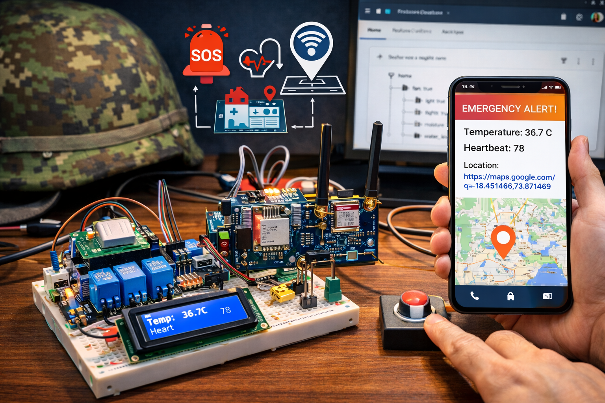

# 🪖 Soldier Health Monitoring and Position Tracking System

An **Arduino UNO–based embedded system** designed to enhance soldier safety by **continuously monitoring health parameters** and **tracking real-time location** using **GPS and GSM technologies**. The system sends **emergency alerts with live location** to a base station via SMS and provides **local feedback through an LCD display**.

---

## 📌 Project Overview

Modern military operations demand real-time awareness of soldiers’ **health status** and **geographical position**. Traditional tracking systems focus only on location and fail to provide vital health insights during emergencies.

This project integrates **wearable sensors**, **GPS positioning**, and **GSM communication** into a **portable Arduino UNO–based system** that continuously monitors a soldier’s **body temperature**, **heartbeat**, and **location**, and sends instant alerts during critical situations.

---

## 🎯 Objectives

- Monitor soldier’s **body temperature** and **heartbeat**
- Track real-time **GPS location**
- Send **emergency SMS alerts** with Google Maps link
- Provide **local visualization** using LCD
- Enable **manual emergency triggering** via push button
- Improve response time during medical or combat emergencies

---

## 🧠 Key Features

- 📍 Real-time GPS position tracking  
- ❤️ Heartbeat monitoring using LDR sensor  
- 🌡️ Body temperature monitoring using LM35  
- 📩 GSM-based SMS alerts  
- 🆘 Emergency push-button alert system  
- 📟 16×2 I2C LCD for local data display  
- 🔌 Portable, low-power embedded solution  

---

## ⚙️ System Architecture

**Soldier Unit → Arduino UNO → Sensors + GPS → GSM → Base Station**

- Sensors collect health data
- GPS provides latitude & longitude
- Arduino processes all inputs
- GSM module sends SMS alerts
- LCD displays live parameters locally

---

## 🧩 Hardware Components

- Arduino UNO  
- GPS Module (NEO-6M or equivalent)  
- GSM Module (SIM900A)  
- LM35 Temperature Sensor  
- LDR-based Heartbeat Sensor  
- Emergency Push Button  
- 16×2 LCD with I2C Module  
- Power Supply & Connecting Wires  

---

## 💻 Software & Technologies

- Arduino IDE  
- Embedded C/C++  
- TinyGPS++ Library  
- SoftwareSerial  
- LiquidCrystal_I2C  

---

## 🚀 Applications

- Battlefield soldier monitoring  
- Remote military operations  
- Disaster rescue missions  
- High-risk security deployments  
- Emergency health response systems  

---

## ⚠️ Challenges & Limitations

- GSM network dependency in remote areas  
- Arduino UNO is not military-grade hardware  
- No data encryption (SMS based)  

---

## 🔮 Future Enhancements

- Satellite communication module  
- Encrypted data transmission  
- Cloud-based monitoring dashboard  
- AI-based health anomaly detection  
- Ruggedized military-grade hardware  

---

## 📄 Research Reference

This project is based on the IEEE conference paper:

**“Soldiers Health Monitoring and Position Tracking System”**  
2024 IEEE International Students’ Conference on Electrical, Electronics and Computer Science

---

## 📜 License

This project is intended for **academic and research purposes**.  
Free to use with proper attribution.

---

⭐ If you find this project useful, consider starring the repository!

